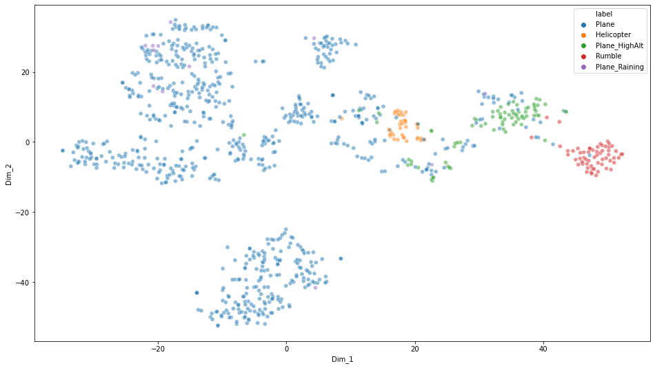

# ANC Project Report 1 - Linus

## Motivation
To find clusters using dimension reduction techniques given the data collected and provided.

## Data downloaded and overview
The downloaded files from One-Drive for this work:

* One Drive
    * FFT-A
    * FFT-Z
    * SPL-A
    * SPL-Z
    * 3rd-Octave-A
    * 3rd-Octave-Z
    * Spectrogram A
    * Spectrogram Z

All the above downloaded folders consist of 918 collected and annotated files. Total size of 35Gb.

The downloaded raw data are stored in the following path:
```
smb://10.97.31.159/SNTL_2/Linus/ANC-Project/ANC-Data/
```
## Data preprocessing

The preprocessing of the provided data can be broken into 5 steps:

1. Reading
2. Converting
3. Standardizing
4. Labelling
5. Exporting

### Reading 
To read the provided .asc files and converting to numpy arrays, .npy files for data processing.

```python
# convert asc files to npy files
path = '../ANC-Data/Spectrogram-A/Spectrogram (A)/'
npy_dest_path = '../ANC-Data-NPY/Spectrogram-A/'
files = glob.glob(path + '*')

for i in files:
    with codecs.open(i, encoding='utf-8-sig') as f:
        X = np.loadtxt(f, usecols=(0,1))
        np.save(npy_dest_path + i.split('/')[-1][:-3] + 'npy', X)
```

The converted and exported npy files are stored in the following path:
```
smb://10.97.31.159/SNTL_2/Linus/ANC-Project/ANC-Data-NPY/
```

### Standardization
Standardization of a dataset is a common requirement for many
machine learning estimators: they might behave badly if the
individual features do not more or less look like standard normally
distributed data (e.g. Gaussian with 0 mean and unit variance).

Standardize features by removing the mean and scaling to unit variance

The standard score of a sample `x` is calculated as:

    z = (x - u) / s

where `u` is the mean of the training samples or zero if `with_mean=False`,
and `s` is the standard deviation of the training samples.

Centering and scaling happen independently on each feature by computing
the relevant statistics on the samples in the training set.

### Labelling

A new column, titled 'Class', is inserted into the dataframe.
As the filenames provided were annotated with the sound class, the labelling is automated with a script that runs through the filenames and assigns the corresponding sound class as a datapoint under the 'Class' column. 

Figure 1 shows the generated new 'Class' column, alongside the corresponding analysis entries for each sound class.

### Exporting

```python
df.to_csv('./testing_standardized_flattened.csv')
# convert to pickle to retain assigned data types the dataframe since csv would all be converted to strings
df.to_pickle('./testing_standardized_flattened.pickle')
```

The exported pickle and csv files are stored in the following path:
```
smb://10.97.31.159/SNTL_2/Linus/ANC_Project/Scripts/
```

## Overview of dataframe

Dataframe:

* 918 entries (rows)
    - 700 Planes
    - Planes (Raining)
    - Planes (High altitude)
    - Helicopters
    - Rumble

- 9 features (columns)
    - Class
        - Planes
        - Planes_Raining
        - Planes_HighAlt
        - Helicopter
        - Rumble
    - FFT-A
    - FFT-Z
    - SPL-A
    - SPL-Z
    - 3rd-Octave-A
    - 3rd-Octave-Z
    - Spectrogram-A
    - Spectrogram-Z


*Figure 1: A snippet of the processed and exported dataframe. Each row is a data entry for the which consists the sound class and its corresponding analysis entries.*

## Clustering
Several clustering techniques have been experimented. The techniques include dimension reduction techniques like PCA and TSNE, and others, like using variational autoencoder (VAE) for the deep model to learn and cluster with the latent space.

### PCA
Principal component analysis, or PCA, is a statistical procedure that allows you to summarize the information content in large data tables by means of a smaller set of “summary indices” that can be more easily visualized and analyzed. [1]

### TSNE
t-SNE creates a probability distribution using the Gaussian distribution that defines the relationships between the points in high-dimensional space. t-SNE uses the t-distribution to recreate the probability distribution in low-dimensional space. [2]

### PCA with TSNE
The idea of using both PCA and TSNE to visualize the high dimensional principal components in a 2D space.

PCA here takes in the high dimensional features of say the FFT-A with 918 entries of shape 12285 bins values and calculates the primary components

In this experiment, we took 50 principal components for the features

Then we further reduce the 50 principal components with TSNE into 2 dimensions for visualization purpose.

#### Single feature
##### FFT-A


##### FFT-Z


##### 3rd-Octave-A


##### 3rd-Octave-Z



#### Combined features
##### 3rd-Octave(A) and 3rd-Octvate(Z)


```python
```

## Conclusion
For both FFT(A, Z) and 3rd-Octave(A, Z) we can observe that there are clusters being formed given the. 

The 3rd-Octave(A, Z) features seems to provide the best clustering as since from the above figures.

## Future work
Experiment on other clustering algorithms and techniques.
Experiment on employing variational autoencoder (VAE) for deep model to learn and cluster with the latent space by employing reconstruction loss for optimization.

## Reference
[1] https://blog.umetrics.com/what-is-principal-component-analysis-pca-and-how-it-is-used#:~:text=Principal%20component%20analysis%2C%20or%20PCA,more%20easily%20visualized%20and%20analyzed

[2] https://mlexplained.com/2018/09/14/paper-dissected-visualizing-data-using-t-sne-explained/#:~:text=t%2DSNE%20creates%20a%20probability,distribution%20in%20low%2Ddimensional%20space.&text=t%2DSNE%20uses%20multiple%20tricks%20to%20try%20to%20avoid%20this%20problem