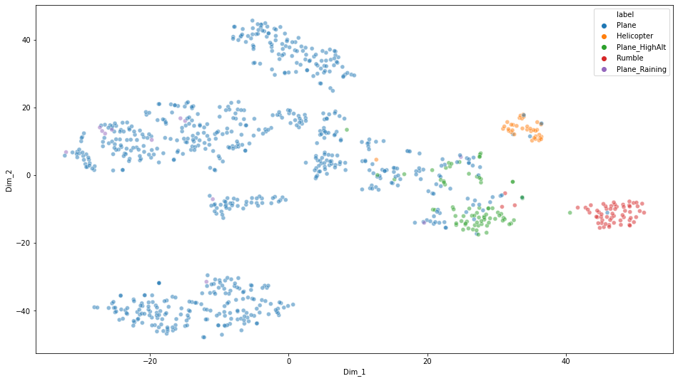
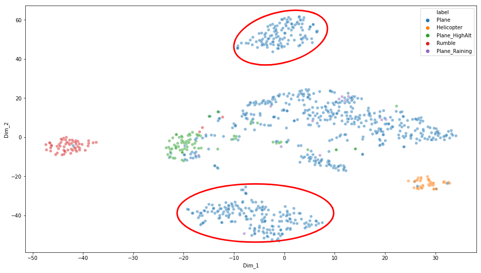
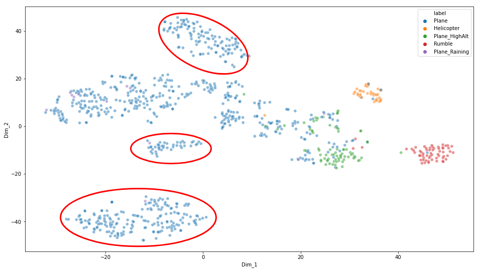

# ANC Project Report 1 - Linus

## Motivation

To find clusters using dimension reduction techniques given the data collected and provided.

One of the most important aspects of dimensionality reduction is data visualization. Having to drop the dimensionality down to two or three, make it possible to visualize the data on a 2d or 3d plot, meaning important insights can be gained by analysing these patterns in terms of clusters and much more.

## Data downloaded and overview

The downloaded files from One-Drive for this work:

- One Drive
  - FFT-A
  - FFT-Z
  - SPL-A
  - SPL-Z
  - 3rd-Octave-A
  - 3rd-Octave-Z
  - Spectrogram A
  - Spectrogram Z

All the above downloaded folders consist of 918 collected and annotated files. Total size of 35Gb.

The downloaded raw data are stored in the following path:

```
smb://10.97.31.159/SNTL_2/Linus/ANC-Project/ANC-Data/
```

## Data preprocessing

The preprocessing of the provided data can be broken into 5 steps:

1. Reading
2. Converting
3. Standardizing
4. Labelling
5. Exporting

### Reading

To read the provided .asc files and converting to numpy arrays, .npy files for data processing.

```python
# convert asc files to npy files
path = '../ANC-Data/Spectrogram-A/Spectrogram (A)/'
npy_dest_path = '../ANC-Data-NPY/Spectrogram-A/'
files = glob.glob(path + '*')

for i in files:
    with codecs.open(i, encoding='utf-8-sig') as f:
        X = np.loadtxt(f, usecols=(0,1))
        np.save(npy_dest_path + i.split('/')[-1][:-3] + 'npy', X)
```

The converted and exported npy files are stored in the following path:

```
smb://10.97.31.159/SNTL_2/Linus/ANC-Project/ANC-Data-NPY/
```

### Standardization

Standardization of a dataset is a common requirement for many
machine learning estimators: they might behave badly if the
individual features do not more or less look like standard normally
distributed data (e.g. Gaussian with 0 mean and unit variance).

Standardize features by removing the mean and scaling to unit variance

The standard score of a sample `x` is calculated as:

    z = (x - u) / s

where `u` is the mean of the training samples,
and `s` is the standard deviation of the training samples.

Centering and scaling happen independently on each feature by computing
the relevant statistics on the samples in the training set.

### Labelling

A new column, titled 'Class', is inserted into the dataframe.
As the filenames provided were annotated with the sound class, the labelling is automated with a script that runs through the filenames and assigns the corresponding sound class as a datapoint under the 'Class' column.

Figure 1 shows the generated new 'Class' column, alongside the corresponding analysis entries for each sound class.

Although the 3 main classes are 'Plane', 'Helicopter' and 'Rumble', the provided annotated filenames included 2 more sub-classes ('Plane_Raining' and 'Plane_highAltitude') for 'Plane'.

The finer subclasses are labelled in the dataframe as such, therefore, making the total number of classes to be 5. This will provide us better insights for the variants of class 'Plane' when we visualize the data in a 2D space.

### Exporting

```python
df.to_csv('./testing_standardized_flattened.csv')
# convert to pickle to retain assigned data types the dataframe since csv would all be converted to strings
df.to_pickle('./testing_standardized_flattened.pickle')
```

The exported pickle and csv files are stored in the following path:

```
smb://10.97.31.159/SNTL_2/Linus/ANC_Project/Scripts/
```

## Overview of dataframe

Dataframe:

- 918 entries (rows)
  - 732 "Planes" entries
  - 12 "Planes (Raining)" entries
  - 77 "Planes (High altitude)" entries
  - 37 "Helicopters" entries
  - 60 "Rumble" entries

* 9 features (columns)
  - Class
    - Planes
    - Planes_Raining
    - Planes_HighAlt
    - Helicopter
    - Rumble
  - FFT-A
  - FFT-Z
  - SPL-A
  - SPL-Z
  - 3rd-Octave-A
  - 3rd-Octave-Z
  - Spectrogram-A
  - Spectrogram-Z


_Figure 1: A snippet of the processed and exported dataframe. Each row is a data entry for the which consists the sound class and its corresponding analysis entries._

## Dimensionality Reduction

Several techniques have been experimented. The techniques include dimension reduction techniques like PCA and TSNE,

### Principal Component Analysis (PCA)

Principal component analysis, or PCA, is a statistical procedure that allows you to summarize the information content in large data tables by means of a smaller set of “summary indices” that can be more easily visualized and analyzed [1].

### t-distributed stochastic neighbour embedding (TSNE)

TSNE creates a probability distribution using the Gaussian distribution that defines the relationships between the points in high-dimensional space. TSNE uses the t-distribution to recreate the probability distribution in low-dimensional space [2].

### PCA with TSNE

The idea is using both PCA and TSNE to visualize the high dimensional principal components in a 2D space.

The approach can be summarised in 2 steps. The first, applying PCA to reduce the high dimension data of say 12285 bins of standardized FFT values into a lower dimension. The seconnd, applying TSNE on the reduced principal components to visualize the possible clusters on a 2 dimensional space.

PCA here takes in the high dimensional features of the FFT-A with 918 entries of shape 12285 bins values and calculates the principal components. The number of components used in this work is set to 50.
The extracted 50 principal components of the features were further reduced with TSNE into 2 dimensions for visualization purpose.

Since FFT and 3rd-Octave are in fixed bins, 12285 and 111 respectively, we do not need to segment the data points to provide a fixed shape when feeding into both reduction algorithms.

As for the Spectrogram and SPL features, since the raw audio files used to compute these features in unequal length in time initially, we would have to segment the data points in order to provide acceptable inputs for the reduction algorithms.

The following subsections shows the reduced dimensions in a 2D space for visualization. The features are plotted in both static and dynamic figures. The static plot applied 1000 iterations on the TSNE algorithm, whereas the dynamic plot shows a successions of 250-interval iterations in the range of 250 to 10000 iterations.

#### Single feature

##### FFT-A

12285 FFT-A bins > PCA > 50 principal components > TSNE > 2D Visualization


_Figure 2: TSNE plot on the FFT-A feature, number of iterations = 1000_


_Figure 3: Dynamic plot of the FFT-A feature, iterations range from 250 to 10000_

##### FFT-Z

12285 FFT-Z bins > PCA > 50 principal components > TSNE > 2D Visualization


_Figure 4: TSNE plot on the FFT-Z feature, number of iterations = 1000_


_Figure 5: Dynamic plot of the FFT-Z feature, iterations range from 250 to 10000_

##### 3rd-Octave-A

111 3rd-Octave-A bins > PCA > 50 principal components > TSNE > 2D Visualization


_Figure 6: TSNE plot on the 3rd-Octave-A feature, number of iterations = 1000_


_Figure 7: Dynamic plot of the 3rd-Octave-A feature, iterations range from 250 to 10000_

##### 3rd-Octave-Z

111 3rd-Octave-Z bins > PCA > 50 principal components > TSNE > 2D Visualization


_Figure 8: TSNE plot on the 3rd-Octave-Z feature, number of iterations = 1000_


_Figure 9: Dynamic plot of the 3rd-Octave-Z feature, iterations range from 250 to 10000_

##### SPL-A

For the SPL feature, different audio length of the provided files yield different number of observable data points. Segmentation of data is required to fix the data points in order to fit the algorithm.
SPL-A is segmented to fit the nearest 6000 data points, giving the shape of (918, 6000) representing the number of entries and SPL data points respectively.


_Figure 10: TSNE plot on the SPL-A feature, number of iterations = 1000_

The figure above does not show a good correlation for the different classes based on the SPL feature. It is assumed that the very nature of SPL for say "Helicopter" class could very likely be of a similar level to that of a "Plane" or "Rumble" class data.

#### Combined features

##### 3rd-Octave(A) and 3rd-Octvate(Z)

Concatenated 222 3rd-Octave-A and Z bins > PCA > 50 principal components > TSNE > 2D Visualization


_Figure 10: TSNE plot on the 3rd-Octave-A and Z features, number of iterations = 1000_


_Figure 11: Dynamic plot of the 3rd-Octave-A and Z features, iterations range from 250 to 10000_

## Conclusion

For both FFT(A, Z) and 3rd-Octave(A, Z) features, we can observe clusters in the 2D space after applying both the dimensionality reduction algorithms.

The 3rd-Octave(A, Z) features are able to exhibit good distinct clusters as visualized from the above figures.

On top of the ability to visualize a segregation between the 3 coarse classes ("Plane", "Helicopter", "Rumble"), new found clusters for "Plane" class can be observed from the figures.

Both figures shown below describe the new clusters observed that could be of different signatures for a different range of filters to be applied on during operation.


_Figure 12: New clusters observed on TSNE plot for 3rd-Octave-A features_


_Figure 13: New clusters observed on TSNE plot for 3rd-Octave-A and Z features_

## Future work

Experiment on other clustering algorithms and techniques.
Experiment on employing variational autoencoder (VAE) for deep model to learn and cluster with the latent space by employing reconstruction loss for optimization.

## Reference

[1] https://blog.umetrics.com/what-is-principal-component-analysis-pca-and-how-it-is-used#:~:text=Principal%20component%20analysis%2C%20or%20PCA,more%20easily%20visualized%20and%20analyzed

[2] https://mlexplained.com/2018/09/14/paper-dissected-visualizing-data-using-t-sne-explained/#:~:text=t%2DSNE%20creates%20a%20probability,distribution%20in%20low%2Ddimensional%20space.&text=t%2DSNE%20uses%20multiple%20tricks%20to%20try%20to%20avoid%20this%20problem
